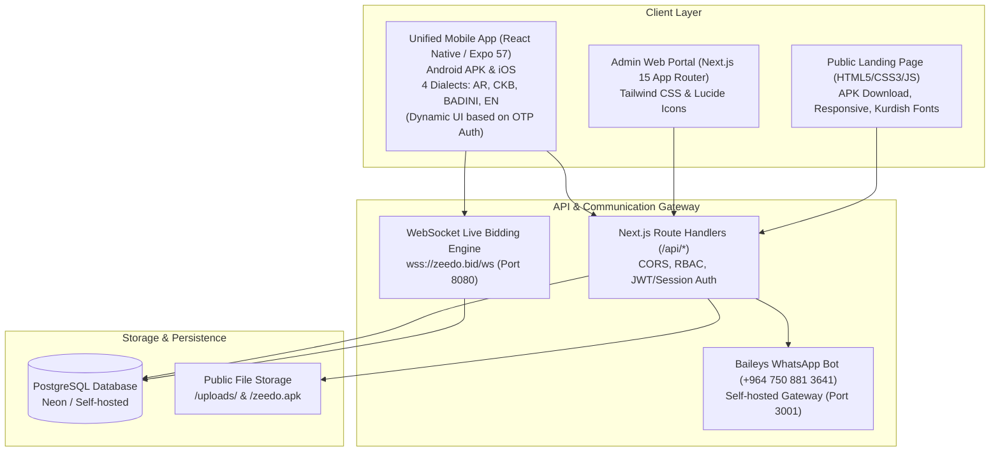
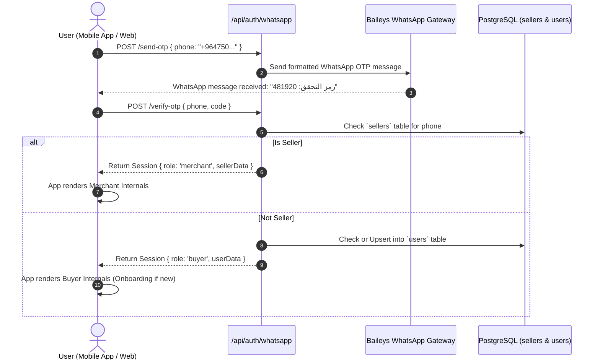
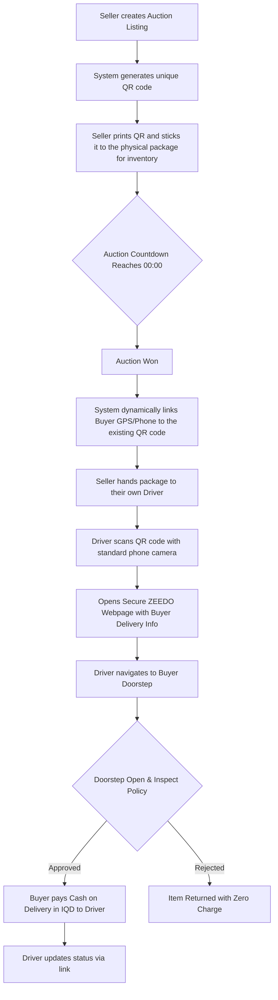
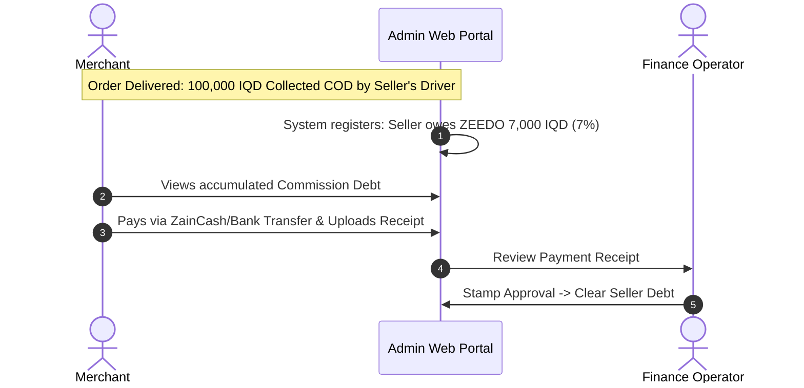

# ZEEDO BID APP: Comprehensive Functionality & End-to-End Workflow Specification

---

## 1. Executive Platform Architecture

ZEEDO is a live auction and real-time commerce platform tailored specifically for the Iraqi and Kurdistan markets. It connects verified merchants (sellers) and retail buyers through live competitive bidding, backed by a **Doorstep Open & Inspect Guarantee (حق المعاينة قبل الدفع)** and **Cash on Delivery (COD)** in Iraqi Dinars (IQD).

---

## 2. User Roles & Platform Personas

ZEEDO operates across three distinct user roles, authenticated exclusively via passwordless WhatsApp OTP:

### 2.1 The Buyer Experience
- **Guest Bidder**: Can freely explore active/upcoming auctions, filter by Iraqi categories, watch live countdowns, and change interface language.
- **Authenticated Bidder**: Authenticated via WhatsApp 6-digit OTP (record in `users` table). Must set a real name and delivery location before bidding.
- **KYC-Verified Bidder**: Verified Iraqi National Card, granting access to high-value auctions.

### 2.2 The Merchant (Seller) Experience
- Provisioned by ZEEDO Administration. Their phone number is registered in the `sellers` table.
- **Unified App Login**: When a merchant logs into the standard mobile app or web portal via WhatsApp OTP, the backend detects their phone number in the `sellers` table and automatically renders the Merchant Dashboard internals instead of the Buyer UI.
- Can create and publish auction lots, generating dynamic inventory QR codes.
- Tracks net sales volume and platform commissions.

### 2.3 The Administrator & Operator Experience
- Oversees live bidding streams and logistics via the Web Portal.
- Ability to extend or freeze countdowns, trigger emergency pauses, void fraudulent bids.
- Provisions merchants and arbitrates doorstep disputes.

---

## 3. End-to-End Core Workflows

### 3.1 Authentication Workflow (Unified Passwordless OTP)

Traditional SMS suffers high failure rates in Iraq. ZEEDO utilizes a **Self-Hosted Baileys WhatsApp Gateway**. There are no passwords.

> [!NOTE]
> **Mobile UX:** A root-level `KeyboardAvoidingView` globally ensures that whenever the virtual numeric keyboard opens across the app, the interface smoothly slides upward so inputs are never obscured.

---

### 3.2 Real-Time Auction Bidding & Anti-Sniping Engine

An automated **Anti-Sniping Protocol** with dynamic scaling eliminates last-second bot manipulation.

#### Sniping & Increment Rules:
| Current Bid Range (IQD) | Minimum Increment Step (IQD) | Anti-Sniping Trigger Window | Extension Added |
| :--- | :--- | :--- | :--- |
| **1,000 – 25,000** | 1,000 IQD | Last 60 seconds | +60 seconds |
| **25,000 – 100,000** | 2,500 IQD | Last 60 seconds | +60 seconds |
| **100,000 – 500,000** | 5,000 IQD | Last 60 seconds | +60 seconds |
| **500,000 – 2,000,000** | 25,000 IQD | Last 90 seconds | +90 seconds |
| **2,000,000+** | 50,000 IQD | Last 120 seconds | +120 seconds |

---

### 3.3 Logistics & Delivery (Dynamic Pre-Printed QR Workflow)

ZEEDO implements a streamlined logistics flow where the Seller's *own driver* executes the delivery, utilizing dynamic QR codes.

---

### 3.4 Merchant Financial Settlement & Commission Lifecycle

Since the seller's driver collects the physical cash, the seller retains 100% of the funds and owes ZEEDO the platform commission (default 7%).

---

## 4. Mobile App Navigation Matrix

In the unified app, tabs are strictly ordered for the buyer:

| Tab Position | Buyer View | Merchant View |
| :--- | :--- | :--- |
| **1 (Left)** | **Auctions (المزادات)**: Live Grid, Filtering, Search | **Dashboard**: Active Lots, COD Volume |
| **2** | **Wishlist (المفضلة)**: Saved Lots & Live Countdowns | **Create Lot**: Multi-image, Pricing |
| **3** | **My Bag (حقيبتي)**: Active Bids (default) / Won Lots | **Dispatch**: Scan QR, Track Deliveries |
| **4 (Right)** | **Profile (حسابي)**: Address, KYC, Languages | **Ledger**: Commission Debt, Receipts |

---

## 5. Database Schema Reference (PostgreSQL)

| Table Name | Primary Key | Key Fields & Roles |
| :--- | :--- | :--- |
| **`users`** | `id` | `phone`, `name`, `city`, `rooftop_lat/lng`, `role` |
| **`sellers`** | `id` | `phone` (Auth), `store_name`, `commission_rate`, `pickup_coordinates` |
| **`auctions`** | `id` | `seller_id`, `current_bid_iqd`, `end_time`, `is_anti_sniping_active` |
| **`bids`** | `id` | `auction_id`, `bidder_id`, `amount_iqd` |
| **`won_orders`** | `id` | `auction_id`, `winner_id`, `seller_id`, `winning_bid_iqd` |
| **`merchant_receipts`** | `id` | `seller_id`, `amount_iqd`, `receipt_image_url`, `status` |
| **`cms_banners`** | `id` | Multilingual titles, `image_url` |
